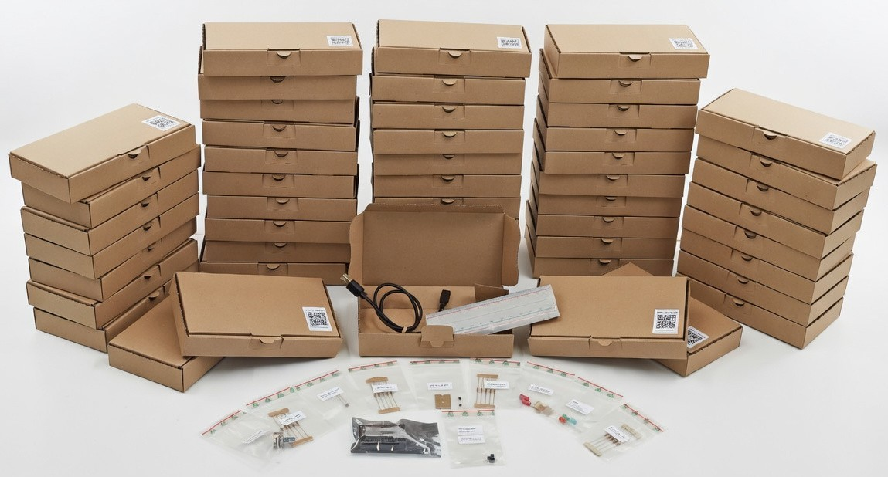

# AMC - Core Kit

## Bill Of Material (BOM)

| Quantity | Component                              | MFR-PN*                                                                                                                             |
|----------|----------------------------------------|-------------------------------------------------------------------------------------------------------------------------------------|
| 1        | ESP32                                  | [SBC-NODEMCU-ESP32](https://joy-it.net/de/products/SBC-NodeMCU-ESP32)                                                               |
| 1        | USB 2.0, USB A to Micro B plug 60 cm   | [USB cable - Berrybase](https://www.berrybase.de/usb-2.0-hi-speed-kabel-a-stecker-micro-b-stecker-schwarz/laenge-0-60-m)            |
| 1        | Breadboard 830 contacts                | [Breadboard - Berrybase](https://www.berrybase.de/breadboard-mit-830-kontakten)                                                     |
| 20       | Jumper cable, Dupont Male to Male 10cm | [DUPK-40-MM-10 - Berrybase](https://www.berrybase.de/40pin-jumper-dupont-kabel-male-male-trennbar/laenge-0-10-m)                    |
| 5        | 220 Ω 5% 1/4W                          | [CF14JT220R](https://www.digikey.de/en/products/detail/stackpole-electronics-inc/CF14JT220R/1741346)                                |
| 5        | 1 kΩ 5% 1/4W                           | [CF14JT1K00](https://www.digikey.de/en/products/detail/stackpole-electronics-inc/CF14JT1K00/1741314)                                |
| 5        | 4.7 kΩ 5% 1/4W                         | [CF14JT4K70](https://www.digikey.de/en/products/detail/stackpole-electronics-inc/CF14JT4K70/1741428)                                |
| 5        | 10 kΩ 5% 1/4W                          | [CF14JT10K0](https://www.digikey.de/en/products/detail/stackpole-electronics-inc/CF14JT10K0/1741265)                                |
| 1        | LED Red                                | [XLUR12D](https://www.digikey.de/en/products/detail/sunled/XLUR12D/4745846)                                                         |
| 1        | LED Green                              | [WP7113GD](https://www.digikey.de/en/products/detail/kingbright/WP7113GD/1747662)                                                   |
| 1        | LED Blue                               | [151051BS04000](https://www.digikey.de/en/products/detail/w%C3%BCrth-elektronik/151051BS04000/4490009)                              |
| 2        | 100uF 20% 16V                          | [860020372006](https://www.digikey.de/en/products/detail/w%C3%BCrth-elektronik/860020372006/5727030)                                |
| 2        | Ceramic 0.1uF 50V                      | [K104K15X7RF5TH5](https://www.digikey.de/en/products/detail/vishay-beyschlag-draloric-bc-components/K104K15X7RF5TH5/286555)         |
| 1        | POT 10kΩ 1/8W carbon linear            | [PTN16-A10115K1B1](https://www.digikey.de/en/products/detail/same-sky-formerly-cui-devices/PTN16-A10115K1B1/20380945)               |
| 1        | NTC 10kΩ 3950K                         | [B57891M0103K000](https://www.digikey.de/en/products/detail/tdk/B57891M0103K000/3500546)                                            |
| 1        | CDS photoresistor 16-33KOHM            | [PDV-P8103](https://www.digikey.de/en/products/detail/advanced-photonix/PDV-P8103/480610)                                           |
| 1        | Switch-NO 0.05A 12V                    | [TS02-66-73-BK-100-SCR-D](https://www.digikey.de/en/products/detail/same-sky-formerly-cui-devices/TS02-66-73-BK-100-SCR-D/15634320) |

*: Manufacturer Product Number (MFR-PN). There is nothing special about these specific MFR-PN, they can be exange with any equivalent component, there are here for completness and tracability of components

Sensors:
- DHT22 (temp + hum)
- SHT31 (temp + hum)
- DS18B20
- Capacitive soil moisture sensor
- DC source

https://www.withdiode.com/

https://internal.fact.fluke.com/plus/courses/public/456/units/4126
