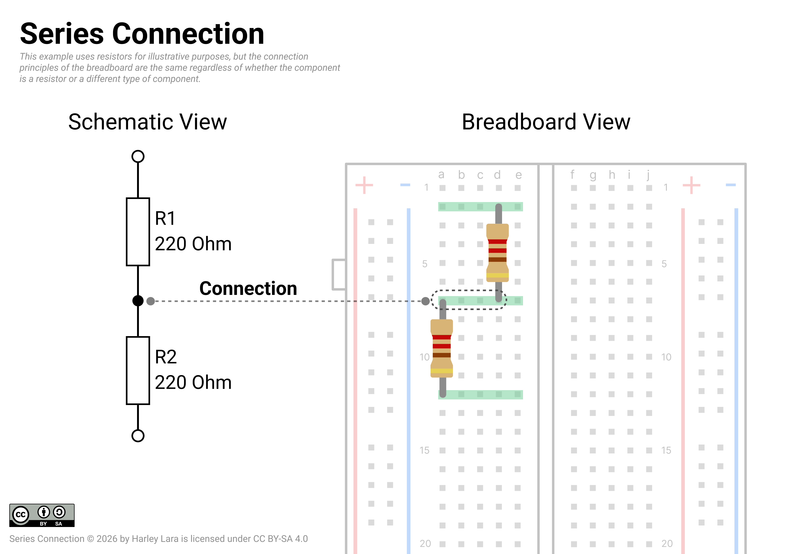
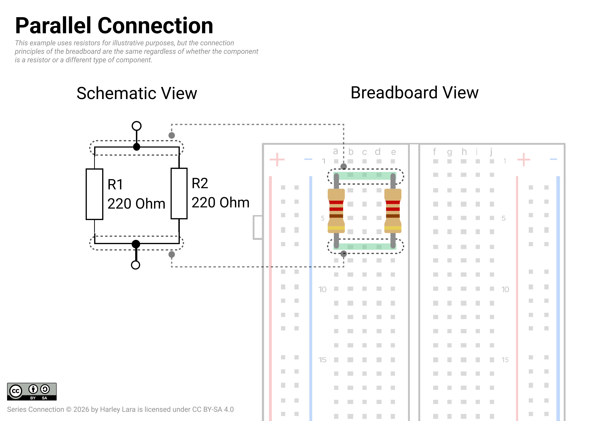

# Breadboard and Schematic

## Schematic

Given the fact that AMC is expending student to have done some courses passed, specifically "8115 Physics: Mechanics, Electricity and Magnetism" that introduce all the concepts related with Electricity and circuits. Under that consider this as recap since you You should be fimilar with the represetation of electical diagramas, normally called "Schematic".

[Electrical Designators - Wikipedia](https://en.wikipedia.org/wiki/Reference_designator#Designators)

## Breadboard

## External Resouces

- [Breadboarding and Prototyping Circuits - Analog Devices Resources](https://www.analog.com/en/resources/analog-dialogue/studentzone/studentzone-november-2016.html) by Walt Kester.
- [Breadboard - Glossary waru.edu](https://www.waru.edu/glossary/breadboard)
- [How to Use a Breadboard - Sparkfun Tutorials](https://learn.sparkfun.com/tutorials/how-to-use-a-breadboard/all)
