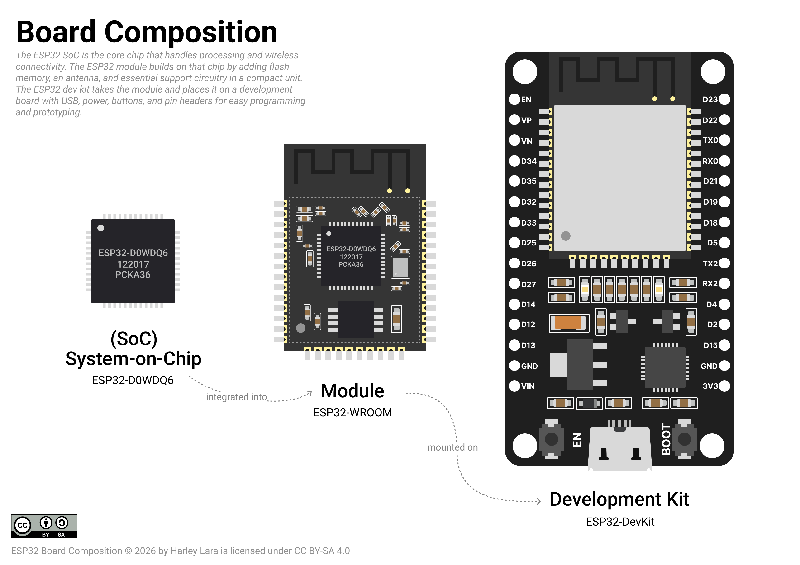

# Disambiguations

- Microcontroller Unit (MCU)
- System on Chip (SoC)
- Module
- Development Kit (DevKit), Development Boards (DevBoard)

## Terminology

- [microprocessor - IEC](https://www.electropedia.org/iev/iev.nsf/display?openform&ievref=171-04-06)
- [processor](https://www.electropedia.org/iev/iev.nsf/display?openform&ievref=171-04-01)
- [IC](https://www.electropedia.org/iev/iev.nsf/display?openform&ievref=521-10-03)

- Microcontroller?? not official definition by standarization body ?
- closes: ISO/IEC TR 5891:2024

## MicroPython vs Arduino
