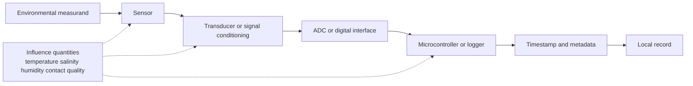
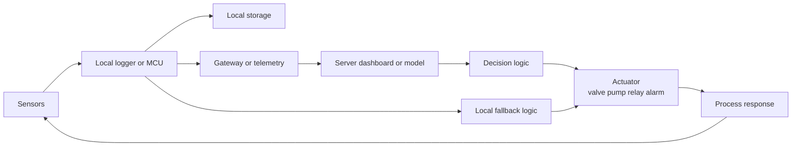

# Introduction

> ‘If you cannot measure it, then it is not science’
Popular Lectures and Addresses vol. 1 (1889) ‘Electrical Units of Measurement’, delivered 3 May 1883

Applied environmental measurement begins with a simple fact: measurement is in the core of science

> “When you can measure what you are speaking about, and express it in numbers, you know something about it.”
>
> — Lord Kelvin, *Oxford Essential Quotations*, 4th ed., ed. Susan Ratcliffe (Oxford Reference)

Measururing by itself is just the tool, to need to pair it with relevant variables, in the context of environment,
[Essential Climate Variables (ECVs)](https://gcos.wmo.int/site/global-climate-observing-system-gcos/essential-climate-variables)

## Summary

In this chapter, we introduce **applied measurement and control** for environmental monitoring from a field-practice perspective. By *applied*, we mean hands-on instrumentation, deployment, logging, troubleshooting, calibration, and interpretation under real outdoor conditions. By *measurement*, we mean the full chain from measurand to sensor indication to stored and interpreted data. By *control*, we do **not** mean a formal treatment of control theory. Instead, we mean the practical routing of data from sensors to loggers, storage, telemetry, decision logic, and actuators such as valves, pumps, relays, and alarms. The metrology vocabulary codified through the Bureau International des Poids et Mesures is especially useful here because it distinguishes sensor, transducer, measuring chain, calibration, adjustment, traceability, and uncertainty with precision.

Our central claim is simple: no environmental measurement is useful unless we understand its uncertainty, calibrate the sensing chain, document metadata, and design the data path all the way to action. At the climate scale, the Global Climate Observing System treats variables such as soil moisture as essential because they provide empirical evidence for understanding and predicting Earth’s changing climate. At field scale, the same logic supports irrigation scheduling, drought assessment, runoff prediction, nutrient transport studies, and ecosystem monitoring. We therefore treat soil moisture as a recurring example because it sits naturally at the intersection of hydrology, agriculture, ecology, meteorology, and remote sensing.

Throughout these notes, we use **we** to mean **we at Eolab**. The tone is intentionally practical. We want students to see that environmental measurement is not just reading a sensor pin. It is the disciplined design of a system that can survive uncertainty, scale mismatch, calibration drift, bad cable routing, power constraints, missed telemetry, and the ordinary hostility of the field.

## Framing and motivation

We measure environmental variables because decisions depend on them. The GCOS Essential Climate Variable framework states that ECV datasets provide the empirical evidence needed to understand and predict climate evolution, assess risks, support mitigation and adaptation, enable attribution, and underpin climate services. That is the global version of the same problem we face at field scale. In irrigation, hydrology, and ecosystem studies, we need observations because water availability, plant stress, infiltration, runoff, and energy exchange cannot be inferred reliably from intuition alone.

Soil moisture is especially useful pedagogically because it can be observed across several scales and through several physical principles. Direct sampling can approximate a reference value at point scale. Buried dielectric probes can provide continuous local time series. Wireless networks can distribute those point measurements across a site. Proximal techniques such as cosmic-ray neutron sensing can bridge the gap between point probes and broad-area remote sensing. Airborne platforms can reveal fine spatial patterns across a field. Space-borne missions such as SMAP and SMOS can place that field into a regional or global context. A good lecture chapter should therefore not ask students to choose one method; it should show them how methods fit together.

It is also important to state clearly what we mean by **control**. In these notes, control is not state-space modeling, Nyquist analysis, or rigorous loop shaping. We will occasionally borrow intuitive control concepts such as feedback, loop closure, autonomy, stability, and fail-safe behavior, but our emphasis is much simpler: how measurements become logged data, how logged data become decisions, and how decisions become actuator commands. The architectural question is therefore not “What is the optimal regulator?” but “How does the chain sensor → logger → storage → telemetry → decision logic → actuator behave under real conditions?”

## Measurement principles and sources of error

The VIM gives us an excellent starting point. A **measuring transducer** is a device used in measurement that provides an output quantity having a specified relation to the input quantity. A **sensor** is the element of a measuring system directly affected by the phenomenon, body, or substance carrying the quantity to be measured. A **measuring chain** is the series of elements constituting a single signal path from sensor to output element. These definitions matter because they prevent a common beginner’s mistake: treating the probe alone as if it were the whole measurement system. In field work, the sensor head, cable, analog conditioning, ADC, firmware, time stamp, storage medium, and communication link all influence the final result.

The same vocabulary defines **measurement uncertainty** as a non-negative parameter characterizing the dispersion of quantity values that can reasonably be attributed to a measurand, based on the information used. The VIM further notes that measurement uncertainty includes components arising from systematic effects and from definitional uncertainty. Just as importantly, it states that measurement error should not be confused with production error or mistake. This is the large lecture-slide point in plain words: in our context, **error means uncertainty**, not incompetence.

A helpful classroom example is measuring the height of a door. A stick gives a crude estimate. A ruler or tape improves the reading, but alignment and endpoint choice still matter. A caliper improves precision, but only on a limited span. An interferometer pushes the problem into high-level dimensional metrology, yet even there the result is still limited by the refractive index of air and the thermal expansion of the artifact. The National Institute of Standards and Technology notes explicitly that these are two of the most significant sources of uncertainty in high-accuracy length measurements. The lesson generalizes perfectly to environmental work: better hardware helps, but influence quantities and definition of the measurand still dominate.

The door example also exposes a deeper issue: sometimes the measurand itself is not fully defined. Where exactly is the top of the door? At the center, at the corner, on the hinge side, or on the latch side? From which floor reference point? The VIM calls the uncertainty imposed by incomplete definition of the measurand **definitional uncertainty**, and it describes this as the practical minimum uncertainty achievable for a given measurand definition. Environmental scientists face the same problem constantly. What exactly is “soil moisture” at a site if the soil profile is layered, roots are unevenly distributed, and the sensing volume is only a small fraction of the root zone?

### Uncertainty Sources

| Source class                  | Typical examples                                                                                         | What it affects                       | Typical mitigation                                                           |
|-------------------------------|----------------------------------------------------------------------------------------------------------|---------------------------------------|------------------------------------------------------------------------------|
| Measurement and model errors  | Poor measurand definition, wrong sensing depth, poor support-scale match, ambiguous averaging interval   | Representativeness and interpretation | Better protocol, correct sampling design, explicit definitions, metadata     |
| Tool and instrument errors    | Noise, drift, finite resolution, ADC quantization, clock drift, connector faults, offset and gain errors | Raw indication and repeatability      | Repetition, diagnostics, calibration, maintenance, stable power              |
| External influence quantities | Temperature, humidity, salinity, clay content, bulk density, poor soil contact, atmospheric conditions   | Sensor response and model validity    | Compensation, shielding, installation quality, soil-specific calibration     |
| Data-path errors              | Packet loss, storage failure, bus-address conflicts, missed time stamps, power sag                       | Integrity of the final data record    | Local storage, RTC validation, quality flags, robust wiring and power design |

The table above is a synthesis of VIM terms, NIST uncertainty practice, in situ soil-moisture installation guidance, and soil-moisture quality guidance. The main pedagogical point is that uncertainty enters long before we “analyze the data.” It enters at definition, installation, sensing, timing, logging, and communication.

## Error analysis

Error analysis is the study and evaluation of uncertainty in measurement. In practical work, we begin by separating what repeated observations can tell us from what prior knowledge, calibration information, and engineering judgment must supply. NIST Technical Note 1297 calls the first route **Type A evaluation** and the second **Type B evaluation**. It defines Type A evaluation as uncertainty estimation based on valid statistical treatment of data, and Type B evaluation as uncertainty estimation based on scientific judgment using relevant available information such as previous measurement data, experience with materials and instruments, manufacturer specifications, calibration reports, and reference data.

This distinction is extremely useful in the field. If we hold an environmental variable approximately constant and repeat a measurement many times, the spread of results contributes to Type A uncertainty. But if we know from calibration records that the sensor drifts with temperature, or from installation experience that poor soil contact biases readings, or from manufacturer documentation that a certain operating range is less reliable, those contributions usually enter through Type B evaluation. NIST also stresses that Type A evaluations based on limited data are not automatically more reliable than sound Type B evaluations. That is an important corrective to a naive “statistics beats judgment” mindset. In practice, both routes are necessary.

A compact measurement model can be written as

$$
y = f(x_1, x_2, \ldots, x_n),
$$

where $y$ is the measurand and the $x_i$ are input quantities. If the inputs are uncorrelated, the combined standard uncertainty is commonly expressed as

$$
u_c(y)=\sqrt{\sum_{i=1}^{n}\left(c_i\,u(x_i)\right)^2},
$$

with sensitivity coefficients $c_i=\partial f/\partial x_i$. If covariance matters, covariance terms must be added. NIST describes this as the law of propagation of uncertainty, commonly referred to as the root-sum-of-squares method. The VIM then defines expanded uncertainty as the product of combined standard uncertainty and a coverage factor $k$, usually written as

$$
U = k\,u_c(y).
$$

The VIM further defines an **uncertainty budget** as the statement of a measurement uncertainty, its components, and their calculation and combination. It explicitly recommends including the measurement model, component estimates, covariances, probability-density assumptions, degrees of freedom, type of evaluation, and any coverage factor. The same source defines **target measurement uncertainty** as an uncertainty limit chosen on the basis of intended use. This is excellent field advice. Before we buy hardware, write firmware, or bury probes, we should ask: what decision must this measurement support, and how much uncertainty can that decision tolerate?

## Environmental Measurement Techniques

A useful applied classification for environmental monitoring is based on support scale and sensing geometry: **ground-based direct contact**, **wireless or proximal sensing**, **airborne sensing**, and **space-borne sensing**. One subtle point is worth teaching explicitly: “wireless” is not a sensing physics. A system can be wireless and still use direct-contact probes. It is therefore better to separate *how the environment is sensed* from *how the data are transported*.

### Ground-based direct contact

For soil water content, thermo-gravimetry remains the generally accepted reference method because it directly measures soil water content through sampling and drying. Romano emphasizes that this is effectively the only direct measurement approach among common field methods, but it is destructive and unsuited to high-frequency or large-area observation. That is why field deployments usually move to electronic sensing.

In undisturbed soils, electromagnetic probes dominate practical field work. Caldwell and colleagues describe several common classes: capacitance, impedance, time-domain reflectometry, time-domain transmissometry, and transmission-line oscillation. Their main strengths are temporal continuity, non-destructive operation, compatibility with automated stations, and ease of integration into logging systems. Their weaknesses are equally important: limited support volume, installation sensitivity, larger-than-advertised field errors, and dependence on soil conditions and calibration.

### Wireless and proximal sensing

Wireless environmental monitoring becomes attractive when spatial coverage, low power, and flexible placement matter. A recent LoRa-based monitoring system for particulate matter provides a clear architectural example: low-power distributed sensor nodes send measurements through a gateway to a cloud system that stores, monitors, processes, and visualizes the data. That architecture is directly relevant to environmental stations more generally, even when the measured variable is not air quality.

Proximal methods are indirect methods. Romano states the matter clearly: these techniques do not measure soil water content itself, but rather a correlated physical or physico-chemical property such as dielectric response. Their strength is that they can be deployed in the field, repeated frequently, and recorded automatically. Their weakness is equally clear: in almost all cases, they require accurate calibration curves. This sentence could serve as a governing principle for a large fraction of environmental instrumentation. Automation does not remove the need for calibration; it amplifies it.

A particularly important intermediate-scale method is the **cosmic-ray neutron** method. Romano describes it as a non-invasive above-ground technique that can estimate average soil water content over a circular area with radius of about 300 m and to depths on the order of 0.5–0.7 m, thereby operating at an intermediate scale between point sampling and satellite footprints. In teaching, this method is extremely valuable because it makes scale visible: point probes, cosmic-ray methods, drone mapping, and satellites each observe different support volumes and therefore answer somewhat different questions.

### Airborne sensing

The U.S. Geological Survey defines remote sensing as detecting and monitoring physical characteristics at a distance, typically from satellite or aircraft. The same agency notes that uncrewed aircraft systems can deliver aerial, hyperspectral, and SAR data at resolutions down to a few centimeters, and that they are especially useful at local scales because they are timely, flexible, and comparatively cost-effective. These characteristics make airborne methods ideal for mapping spatial variability that cannot be represented by one buried probe: thermal stress, irrigation nonuniformity, drainage patterns, canopy structure, or localized anomalies. Their weakness is temporal. They provide campaigns and snapshots rather than deep continuous time series.

### Space-borne sensing

NASA describes SMAP as a mission designed to measure and map Earth’s soil moisture and freeze–thaw state in order to improve understanding of terrestrial water, carbon, and energy cycles. The European Space Agency describes SMOS as dedicated to global observations of soil moisture over land and salinity over oceans, with the aim of improving understanding of exchange processes and weather and climate models. These missions represent the great advantage of space-borne sensing: repeatable, systematic, and broad-area coverage. Their main limitations are the coarse footprint relative to field decisions, shallow sensing depth relative to many root-zone problems, and the continued need for ground-based calibration and validation.

### Comparison of Measurement Classes

| Class | Typical examples | Main support scale | Main strengths | Main weaknesses |
|---|---|---|---|---|
| Ground-based direct contact | Gravimetric samples, TDR/FDR probes, buried electromagnetic sensors | Point / near-point | High temporal resolution, depth-specific, continuous logging | Limited representativeness, installation sensitivity, calibration need |
| Wireless / proximal | Sensor networks, LoRa nodes, cosmic-ray neutron sensing | Point networks to tens of hectares | Distributed coverage, automation, flexible deployment | Communication constraints, often indirect, calibration-heavy |
| Airborne | Drone thermal, multispectral, hyperspectral surveys | Local to landscape | Fine spatial detail, flexible timing, rapid surveys | Snapshot sampling, weather and logistics constraints |
| Space-borne | SMAP, SMOS | Regional to global | Repeatable broad coverage, climate relevance | Coarse footprint, shallow support depth, strong validation dependence |

The table above should be read as a scale-and-purpose map rather than as a ranking.

## Calibration and Traceability

Calibration is not a ceremonial step after installation. The VIM defines calibration as the operation that, first, establishes a relation between standards and corresponding indications together with their uncertainties and, second, uses that relation to obtain a measurement result from an indication. The same source notes that calibration may be expressed as a calibration function, curve, diagram, or table. That definition is exactly how we should think in applied environmental monitoring: a probe output becomes a useful environmental quantity only when it is linked by a documented relation to a reference.

The VIM is equally explicit that calibration should not be confused with **adjustment**. Adjustment is the set of operations that makes a measuring system provide prescribed indications. Calibration is the documented relation between standards and indications. The VIM states that calibration is a prerequisite for adjustment and that recalibration is usually required after adjustment. This matters in practice because changing an offset in firmware is not the same thing as calibrating a station.

Traceability is what connects a field station to a defensible reference system. The VIM defines a **metrological traceability chain** as the sequence of measurement standards and calibrations used to relate a measurement result to a reference, and it notes that metrological traceability requires an established calibration hierarchy. Just as importantly, it cautions that traceability alone does not guarantee that the uncertainty is adequate for a particular purpose. In other words, traceability is necessary but not sufficient.

### The ring-oscillator soil-water sensor paper

The paper you specified, by Qu, Bogena, Huisman, and Vereecken, is an ideal applied case. The authors calibrated the low-cost SPADE soil-water sensor for wireless sensor network applications by relating sensor output to dielectric permittivity using reference liquids with known permittivities. They then compared a universal calibration to sensor-specific calibration and found that sensor-to-sensor variability was larger than sensor noise, and that sensor-specific calibration improved the accuracy of soil-water-content estimation. They also derived a temperature-correction function and verified its transferability from reference liquids to soils. This is exactly the kind of result that students must internalize: **low-cost does not mean calibration-free**, and sensor-specific calibration can matter materially.

The broader recent guidance says the same thing. The 2024 USDA review on dielectric soil-moisture sensor calibration states that these sensors require appropriate calibration for precise measurements and that the choice of calibration method depends on sensor type, soil type, and environmental conditions. The 2024 U.S. soil-moisture data-quality guidance goes further: its higher quality tiers require soil-specific laboratory calibration and at least one post-deployment field calibration or validation activity at each deployment location. That is a very strong practical message. Factory calibration may be acceptable for coarse operational use, but higher-quality science usually requires better work.

## Field stations and applied control architecture

A field station should be designed as a coherent stack, not as a shopping list. Wickert and colleagues describe the ALog open-source field logger family as integrating six critical subsystems: power, timekeeping, data storage, sensor interfaces, input/output, and the microcontroller core. The design includes low-power operation and local storage, and the paper emphasizes that hardware alone is not enough; firmware and software are equally important to create an effective measurement platform. The EnviroDIY Mayfly platform expresses the same design logic in compact form, with onboard microSD, RTC, solar charging, battery powering, USB programming, and easy sensor connectivity.

### List of Practical Field Components

| Component | Why we need it | Practical note |
|---|---|---|
| Microcontroller / logger | Schedules acquisition, executes local logic, reads sensors | Must be low-power, stable, and debuggable |
| Sensors | Observe the environmental state | Must match the measurand and decision scale |
| Real-time clock | Provides trustworthy time stamps | Essential for event alignment and data fusion |
| Local data storage | Preserves records during telemetry failure | Non-negotiable in remote sites |
| Data exchange link | Supports commissioning, firmware update, and manual retrieval | USB or serial access remains extremely valuable |
| Optional wireless telemetry | Enables distributed stations and near-real-time visibility | Communication integrity is separate from measurement integrity |
| Power subsystem | Keeps the station alive during duty cycling and outages | Battery sizing shapes sampling and transmission strategy |
| Optional solar charging | Extends deployment duration | Especially important when service visits are expensive |
| Waterproof enclosure | Protects electronics and connectors | Ingress protection often determines long-term success |

This table is directly supported by ALog and Mayfly subsystem design, and by field notes from Eolab deployments showing how communication limitations, power constraints, and remote access realities shape successful instrumentation.

### Measurement chain

This diagram is simply the VIM notion of a measuring chain extended into field engineering. The purpose is pedagogical: we want students to stop blaming “the sensor” for every bad result. A bad time stamp, unstable power rail, bus conflict, or corrupted storage card can damage a data record even if the sensing element itself is functioning.

### Applied control as data flow and actuation

In our usage, this is what **control** means. We are not deriving transfer functions or state-space models. We are designing a robust information-and-action path. The wireless monitoring literature gives the sensor-node → gateway → cloud pattern. The Interreg Irristaud 2.0 project gives the measured-data → algorithms/control-data → targeted irrigation pattern. Taken together, they justify a practical architecture in which field measurements inform actuator commands through traceable data flow.

From these sources, our applied design recommendations are straightforward. First, preserve **local autonomy**: if the network fails, the logger should continue measuring and storing data. Second, implement **fail-safe behavior**: if communications or decision logic fail, the actuator should move to a safe default state or remain under manual supervision. Third, log the full chain: raw measurements, processed measurements, calibration version, metadata, and actuator commands.

## Scale, field reality, examples, and checklist

Scale is one of the hardest problems in environmental monitoring. The classic review by Blöschl and Sivapalan frames scale as a central hydrological problem, and the companion paper on the representative elementary area argues that both the existence and the size of such a representative scale are specific to the catchment and the application. This is a profound lesson for students: there is no universal guarantee that one probe, one plot, or one averaging length “represents” the landscape. Representativeness is conditional, not automatic.

Soil moisture makes this issue impossible to ignore. Romano’s irrigation review explicitly organizes monitoring around space–time scales. The NASA review by Ochsner and coauthors organizes the field around in situ and proximal sensing, remote sensing missions, monitoring networks, and applications. Romano also emphasizes that indirect methods must be interpreted together with modeling and support-scale reasoning, not as if they delivered scale-free truth. We should therefore teach environmental monitoring as a **support-scale matching problem**. Point probes, cosmic-ray methods, drones, and satellites do not compete on one axis; they sample different spatial supports and temporal cadences.

### Common field problems

The field is merciless. In undisturbed soils, buried probes may be difficult to insert cleanly, especially in gravelly or clay-rich horizons. Longer tines integrate larger volumes but can be harder to install and more vulnerable to signal loss in conductive soils. Sensors on a common SDI-12 line require proper unique addressing. Maintenance quality, metadata completeness, calibration rigor, and data validity all affect the eventual classification of data quality. The 2024 data-quality guidance makes these criteria explicit, including maintenance frequency, metadata completeness, soil-specific calibration, post-deployment validation, and valid-data fractions over time.

The Eolab field notes reflect exactly the same realities from practice. Our dendrometer overview records the need for a small LoRaWAN node compatible with the sensor and rapidly prototyped for deployment. The broader EcoTower notes record limited monthly data transfer, a dynamic IP address, occupied network ports, a Raspberry Pi used for on-site services, and SSH-only remote access. None of these are exotic edge cases. They are normal field conditions. That is why applied measurement and applied control belong in the same chapter.

### Irristaud 2.0 as an applied example

The Interreg project Irristaud 2.0 is a very good teaching case because it ties together sensing, data processing, and actuation. The official project description says that the project combines plant-stress sensing based on leaf positions and photosynthesis, conventional soil measurements, flying and mobile sensor systems, AI-based transformation of measured data into algorithms and control data, and targeted, metered irrigation. The project information page identifies Compas Agro B.V. as lead partner, with partners including Forschungszentrum Jülich, Hochschule Rhein-Waal, and Yookr B.V. For our purposes, the exact partnership structure matters less than the architecture: measurements become data, data become control logic, and control logic drives irrigation action.

### Field deployment checklist

Before deployment, we should verify the following.

- Is the measurand precisely defined?
- Does the support scale of the chosen sensor match the decision scale?
- Is there a documented calibration, and is it site- or soil-specific where necessary?
- Have influence quantities such as temperature, salinity, and contact quality been considered?

- Is the RTC configured correctly and rechecked after power interruptions?
- Is local storage available if telemetry fails?
- Can the station be reached locally by cable or serial link for diagnosis?
- If wireless transfer is used, is there a plan for outages, backfill, and packet loss?
- Are battery and solar budgets consistent with the sampling interval and transmission duty cycle?
- Is the enclosure suitable for moisture, dust, thermal loading, and cable strain?
- Is metadata documented with the same care as the measurements?
- Is there a post-deployment validation plan?

- Is actuator behavior logged, fail-safe, and manually overrideable?

This checklist is intentionally practical. The purpose is not to make the station elegant. The purpose is to make the station survive the field while producing defensible data.

## Selected references

- JCGM 200:2012 / ISO/IEC Guide 99:2007. *International Vocabulary of Metrology.*
- Taylor, B. N., and Kuyatt, C. E. *Guidelines for Evaluating and Expressing the Uncertainty of NIST Measurement Results* (NIST Technical Note 1297).
- GCOS. *About Essential Climate Variables* and the 2024 climate monitoring principles.

- NIST. *SI Length and Traceability.*
- Qu, W., Bogena, H. R., Huisman, J. A., and Vereecken, H. 2013. *Calibration of a Novel Low-Cost Soil Water Content Sensor Based on a Ring Oscillator.*
- Blöschl, G., and Sivapalan, M. 1995. *Scale issues in hydrological modelling: A review.*
- Blöschl, G., Grayson, R. B., and Sivapalan, M. 1995. *On the representative elementary area concept and its utility for distributed rainfall-runoff modelling.*

- Romano, N. 2014. *State of the art in monitoring and modeling soil moisture at various scales for irrigation purposes.*
- Ochsner, T. E., et al. 2013. *State of the Art in Large-Scale Soil Moisture Monitoring.*
- Caldwell, T. G., et al. 2022. *In situ Soil Moisture Sensors in Undisturbed Soils.*
- Mane, S., et al. 2024. *Advancements in dielectric soil moisture sensor calibration: A comprehensive review of methods and techniques.*

- U.S. Soil Moisture Data Quality Guidance. 2024.
- Wickert, A. D., et al. 2019. *Open-source Arduino-compatible data loggers designed for field research.*
- EnviroDIY. *Getting Started With the Mayfly Data Logger.*

- USGS. *What is remote sensing and what is it used for?* and *Why does the USGS use uncrewed aircraft systems?*
- NASA JPL. *SMAP mission overview.*
- ESA. *SMOS mission overview.*
- Zafra-Pérez, A., et al. 2024. *Designing a low-cost wireless sensor network for particulate matter monitoring: Implementation, calibration, and field-test.*
- EOLab Wiki. *Dendrometer Overview* and *EcoTower notes.*
- Irristaud 2.0 project page.
