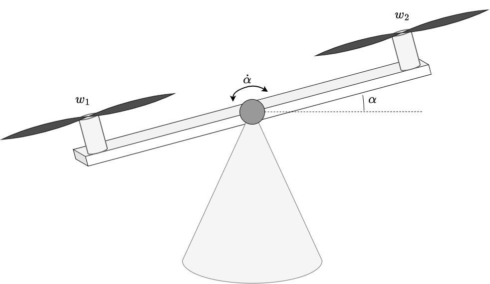

# 01 - Dev. Env. Setup

Requeriments:
- Completion of [Lab 01](../labs/01.md)

Learning outcome:
- Minimal working template for PlatformIO projects
- Making Static libraries

---
## Task 1 - System Identification

Given the following system:

|  |
|---------------------------------------------|
| Figure 1: Seesaw model.                     |

Where:
- $w_1$ and $w_2$ are the angular velocities of the motors.
- $\alpha$ angle of the system.

**Task 1.1**: Identify which signals depicted in figure 1 of the system are the input and output of the system

**Task 1.2**: Which energy reservoirs can you find? What are the states of the system?

**Task 1.3**:  Given this dynamic system model:

$$
\ddot{\alpha}  = \gamma u - k \cdot \cos(\alpha)
$$

Comment and explain your rational on whether the system i:
- time varying / time invariant
- linear / non-linear
- causal / acausal
- memoryless / dynamic

## Task 2 - PlatformIO Project Creation

Create a new project named `assigment-01`, with the following configuration parameters:

```
platform = espressif32
board = esp32dev
framework = arduino
```

---
## Task 3 - Making Network Manager

**Task 3.1**: Create a local network library with the name `NetworkManager`.

```
assigment-01/
└─ lib/
   └─ NetworkManager/
```

**Task 3.2**: Create a library interface that follow this design for intanciation.

```c++
#include <NetworkManager.h>

NetworkManager net;
```

**Task 3.3**: Ensure that your implementation sets a custom hostname for the ESP32. Reference material: [ESP32 Setting a Custom Hostname](https://randomnerdtutorials.com/esp32-set-custom-hostname-arduino/).

**Task 3.4**: In the `NetworkManager` implementation a method called `begin()` with the following signature, that inicitalize the network.

```c++
void NetworkManager::begin()
```

In order to initialize the network: 
1. Try to set the ESP32 in STA mode (Station Mode) to connect to the network SSID `iotlab` password `12345678`
2. If STA mode fails, fallback into AP (Access Point mode) and Create a network using your robot *hostname** as SSID and set any password with at least 8 characters (WAP2). Reference material: https://randomnerdtutorials.com/esp32-useful-wi-fi-functions-arduino/

---
## Task 4 - Making OTA Manager

**Task 4.1**: Setup OTA, under the folder `lib` create a local library called `OTAManager`

**Task 4.2**: Create a the library in a way that allow you to import like `#include <OTAManager.h>` and instancie as `OTAManager ota;`


**Task 4.3**: Witn in the `OTAManager` implementation a method called `begin()` with the following signature that inicitalize the OTAManager. 

```c++
void OTAManager::begin()
```

 Note: you can use any OTA library, for simplicity ArduinoOTA is a good starting point. Example code: https://github.com/espressif/arduino-esp32/blob/master/libraries/ArduinoOTA/examples/BasicOTA/BasicOTA.ino


## Resume

The final working code should look like. Your are free (and encorage) to improve the current definitions and implementation.

```c++
#include <Arduino.h>
#include <NetworkManager.h>
#include <OTAManager.h>

NetworkManager net;
OTAManager ota;

void setup()
{

  Serial.begin(115200);
  delay(200);

  net.begin();
  ota.begin();
}

void loop() {
  ota.handle();
  delay(100);
}
```
