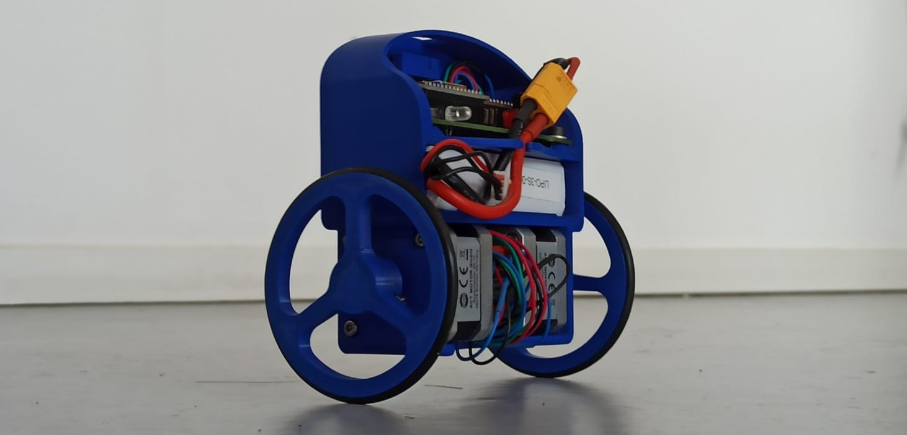

# Control Engineering CI_5.02

Welcome to CI_5.02 Control Systems. This course is intended to provide theoretical and practical insights on control system.

## Teaching Team

- [Prof. Dr.-Ing. Rolf Becker](https://www.hochschule-rhein-waal.de/en/user/7254)
- [Harley Lara](https://www.hochschule-rhein-waal.de/de/user/9804)

## Description

- **Location & time**: Raum 02 02 510 (KaLi)
  - Lecture: 14:00
  - Labs: 16:00
- **Teaching Semester**: Winter 2025/26
- **Credits**: 5 CP
- **Duration**: 1 semester
- **Total Workload (semester)**: 150 h, distributed as follows: 
  - Lecture (15%): 22.5 h
  - Labs/Exercises (15%): 22.5 h
  - Self-study (70%): 105 h

## Session Structure and Format

- Lecture (seminar format): 1 hour 30 minutes in person. Personal attendance on campus is highly recommended.
- Assignment presentation (task description and objectives): 10–15 minutes
- Laboratory session / assignment discussion: 40 minutes

Note: sessions will not be recorded.

## Schedule Overview

The following schedule is subject to modifications.

| Week | Date       | Topic(s)                                                         | Session Material                                                   |
|------|------------|------------------------------------------------------------------|--------------------------------------------------------------------|
| W1   | 2025.10.10 | Fundamentals and system modeling (Part 1).                       | [Assignment 01](./assignments/01.md) [Lab 01](./labs/01.md)    |
| W2   | 2025.10.17 | Fundamentals and system modeling (Part 2).                       | [Assignment 02](./assignments/02.md) Discussion: Assignment 01 |
| W3   | 2025.10.24 | 1st/2nd-order time response; specs.                              | [Assignment 03](./assignments/03.md) [Lab 02](./labs/02.md)    |
| W4   | 2025.10.31 | Stability & Routh–Hurwitz.                                       | [Assignment 04](./assignments/04.md) Discussion: Assignment 03 |
| W5   | 2025.11.07 | Root locus & lead/lag via specs.                                 | [Lab 03](./labs/03.md)                                             |
| W6*  | 2025.11.14 | Frequency response, Bode/Nichols; margins & robustness (Part 1). | [Assignment 05](./assignments/05.md) Discussion: Assignment 04 |
| W7*  | 2025.11.21 | Frequency response, Bode/Nichols; margins & robustness (Part 2). | Discussion: Assignment 05                                          |
| W8   | 2025.11.28 | State-space models; time response.                               | [Assignment 06](./assignments/06.md)                               |
| W9   | 2025.12.05 | Controllability/observability; minimal realization.              | Discussion: Assignment 06                                          |
| W10  | 2025.12.12 | State-feedback (pole placement) + integral action.               | [Assignment 07](./assignments/07.md)                               |
| W11  | 2025.12.19 | Observers; separation principle.                                 | [Assignment 08](./assignments/08.md) Discussion: Assignment 07 |
| W12  | 2026.01.09 | Sampling & discrete-time models (ZOH, z-domain).                 | Discussion: Assignment 08                                          |
| W13  | 2026.01.16 | Digital design (discrete PID, RL/Bode in z).                     | [Assignment 09](./assignments/09.md) [Lab 04](./labs/04.md)    |
| W14  |            | Final project demo.                                              |                                                                    |

*: Harley will not be available.

## Assessment & Grading

This course emphasizes learning through practice and transparent evaluation. While certain components are completed individually to help you consolidate knowledge first-hand, discussion with peers, comparing approaches, troubleshooting, and sharing insights is strongly encouraged. Labs and assignments are primarily **formative**: they provide low-stakes opportunities to check your understanding, receive feedback, and build momentum toward the **summative component**, the final project.

### Labs

**When & where**: Immediately after each lecture, in situ (on-site).

**Format**: Live tutorial with guided, hands-on exercises with short, focused demos followed by step-by-step activities that form the baseline for tackling the assignment.

**Purpose**: Equip you with practical tools to complete the assignments and, ultimately, the final project.

**Execution format**: Individual.

**Assessment**: Not graded.

### Assignments

**When & where**: Released alongside the relevant lectures/labs; complete at your own pace. A dedicated review session will be held in situ to address common questions and walk through approaches of your fellow classmates.

**Format**: A mix of practical and theoretical tasks with supporting resources.

**Purpose**: Build progressively on the labs and move you toward the final project; completing each assignment is a step toward the final deliverable.

**Execution format**: Individual.

**Assessment**: Not graded.

### Final Project

The final project consolidates the knowledge and skills from the course into a coherent, real-world-style deliverable. For the full project description see: [Final Project](./final-project.md)

## Communication Channels & Recommendations

**Moodle**: We will use Moodle to make announcements and provide spaces for submitting assignments.

**Discord**: We use Discord as an open platform for collaboration and communication, so you can use it to share information with us, such as technical issues that may be relevant to others, or you can share resources that you consider valuable. Access will be provided during class (to avoid bots).

**Email**: private matters.

In case of technical issues:
- Describe the problem, try to be provide with the steps to reproduce it.
- Do not copy and paste massive logs (preferably less than 20 lines). If necessary attach a file with the complete logs.
- Add screenshoot if necessary.

## Lab Access & Safety

Room 02.02.510 (IoT Lab) will be available for use throughout the semester.

**Safety**: A brief lab safety introduction is required before using the lab.

**Lab Access**: We operate an open-access policy. If the door is open, you are welcome to come in, take a seat, interact with others, and work. Opening hours are not fixed and depend on the lab staff’s schedule. In general, the lab is open from 10:30 to 17:00. We recommend arranging access with the lab staff or [teaching team](#teaching-team)

**Workspace**: If a space is free, feel free to use it. Please keep the area neat and tidy during and after your work.

**Lab Equipment**: The lab provides the resources you need for assignments, lab work, and the final project. However, before operating any tool or workstation, please ask the lab staff for a brief introduction.

**Loan Policy**: Electronic components and some accessories may be borrowed for home use. To arrange this, please contact a member of the [teaching team](#teaching-team).

Any questions or unexpected situations should be reported to the lab staff immediately.

## AI Policy

Use of AI tools (e.g., large language models) is **permitted**, with the expectation of full transparency and academic integrity.

Disclosure requirements (mandatory if you use an LLM):
- Include a public link to the conversation/transcript you used.
  - If a shareable link isn’t possible, attach a PDF export of the exchange.
- State the tool/model name (e.g., “ChatGPT, model unknown/version as reported by the tool”), and the date/time of use.
- Briefly describe what you used it for (e.g., outlining, proofreading, code scaffolding, debugging hints, literature search, etc.).

## Literature for the Course

- Franklin, G. F., Powell, J. D., & Emami-Naeini, A. (2015). Feedback control of dynamic systems (Global ed., 7. ed.). Pearson. [HSRW Library stock](https://hsb-rhein-waal.digibib.net/search/katalog/record/(DE-605)HT018399030)
- Dorf, R. C., & Bishop, R. H. ([2017]). Modern control systems (Thirteenth edition, global edition). Pearson. [HSRW Library stock](https://hsb-rhein-waal.digibib.net/search/katalog/record/(DE-605)HT019167972)
- Åström, K. J., & Murray, R. M. (2008). Feedback systems: an introduction for scientists and engineers. Princeton Univ. Press. [HSRW Library stock](https://hsb-rhein-waal.digibib.net/search/katalog/record/(DE-605)HT015565242)
- Nise, N. S. (2015). Control systems engineering (7. ed.). Wiley. [HSRW Library stock](https://hsb-rhein-waal.digibib.net/search/katalog/record/(DE-605)HT018597987)

## Disclaimer

This site is a supplementary resource for the lecture. It does not replace Moodle, which remains the official platform for announcements, and submissions. These docs are intended to enhance the learning experience and make selected content openly and widely accessible.
